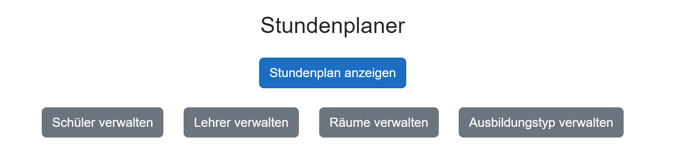

# Stundenplan - Blazor Applikation Projekt
#### Gruppenmitglieder: Dan Krummenacher, Moritz Anliker, Tomàs Texeira Alves, Fynn Piekarek

Die Stundenplan-Applikation ist eine Blazor-Webassembly App mit *.NET 7.0 Framework*. Es wurde in Visual Studio 2022 mit der Programmiersprache C# in der objektorientierten Programmierung programmiert. Dieses Programm bietet verschiedene Funktionen für einen Stundenplan. Man kann Räume, Schüler, Module und auch Lehrpersonen hinzuzufügen sowie eine übersichtliche Anzeige für den Stundenplan. 

# Funktionen
* Hinzufügen/Entfernen/Bearbeiten von Schülern (Inputs: Name, Ausbildungstyp)
* Hinzufügen/Entfernen/Bearbeiten von Lehrpersonen (Inputs: Name, nicht verfügbare Tage)
* Hinzufügen/Entfernen/Bearbeiten von Räumen (Inputs: Raumname, Sitzplatzanzahl, Ausstattung)
* Hinzufügen/Entfernen/Bearbeiten von Ausbildungstypen (Inputs: Name, Module)
* Hinzufügen/Entfernen/Bearbeiten von Lektion
* Anzeige des Stundenplan

# Anforderungen an die Entwicklungsumgebung für die Integration
Getting started - Blazor WebAssembly (.NET 8)                  
                             https://docs.blazorbootstrap.com/getting-started/blazor-webassembly-net-8#_importsrazor

Blazor Local Storage - Only for Blazor WebAssembly
                                      https://github.com/Blazored/LocalStorage/blob/main/README.md

# Anleitung für die Installation 

Damit diese Applikation fehlerfrei laufen kann und alle Funktionen genützt werden können müssen sie die folgende Blazor Bootstrap Anleitung durchgeführt haben.
* folge der Anleitung: [Bootstrap Integration](https://docs.blazorbootstrap.com/getting-started/blazor-webassembly-net-8#_importsrazor)

#### Anleitung

1) Install Nuget Package - Use NuGet package manager:
```
Install-Package Blazor.Bootstrap -Version 1.10.5
```
2) Add CSS references - After the <base href="/" /> tag in the head section of the wwwroot/index.html file, add the following references:
```
<link href="https://cdn.jsdelivr.net/npm/bootstrap@5.2.3/dist/css/bootstrap.min.css" rel="stylesheet" integrity="sha384-rbsA2VBKQhggwzxH7pPCaAqO46MgnOM80zW1RWuH61DGLwZJEdK2Kadq2F9CUG65" crossorigin="anonymous" />
<link href="https://cdn.jsdelivr.net/npm/bootstrap-icons@1.10.3/font/bootstrap-icons.css" rel="stylesheet" />
<link href="_content/Blazor.Bootstrap/blazor.bootstrap.css" rel="stylesheet" />
```
3) Add script references - Insert the following references into the body section of the wwwroot/index.html file, immediately after the _framework/blazor.webassembly.js reference:
```
<script src="https://cdn.jsdelivr.net/npm/bootstrap@5.2.3/dist/js/bootstrap.bundle.min.js" integrity="sha384-kenU1KFdBIe4zVF0s0G1M5b4hcpxyD9F7jL+jjXkk+Q2h455rYXK/7HAuoJl+0I4" crossorigin="anonymous"></script>
<!-- Add chart.js reference if chart components are used in your application. -->
<script src="https://cdnjs.cloudflare.com/ajax/libs/Chart.js/4.0.1/chart.umd.js" integrity="sha512-gQhCDsnnnUfaRzD8k1L5llCCV6O9HN09zClIzzeJ8OJ9MpGmIlCxm+pdCkqTwqJ4JcjbojFr79rl2F1mzcoLMQ==" crossorigin="anonymous" referrerpolicy="no-referrer"></script>
<!-- Add chartjs-plugin-datalabels.min.js reference if chart components with data label feature is used in your application. -->
<script src="https://cdnjs.cloudflare.com/ajax/libs/chartjs-plugin-datalabels/2.2.0/chartjs-plugin-datalabels.min.js" integrity="sha512-JPcRR8yFa8mmCsfrw4TNte1ZvF1e3+1SdGMslZvmrzDYxS69J7J49vkFL8u6u8PlPJK+H3voElBtUCzaXj+6ig==" crossorigin="anonymous" referrerpolicy="no-referrer"></script>
<script src="_content/Blazor.Bootstrap/blazor.bootstrap.js"></script>
```
4) Register services - Add Blazor Bootstrap service in the Program.cs
```
builder.Services.AddBlazorBootstrap();
```
Register tag helpers in _Imports.razor
```
@using BlazorBootstrap;
```

5) Remove default references - The default Blazor template includes demonstration code and Bootstrap. To remove these components, follow these steps:

* Delete the bootstrap folder from the wwwroot directory:
  Delete the wwwroot/css/bootstrap folder.
* Remove the following line from wwwroot/index.html file:
```
<link href="css/bootstrap/bootstrap.min.css" rel="stylesheet" />
```

# Webseitenansicht


### Projektstatus
Status: Erledigt<br>
Die Stundenplan-Applikation ist fertig programmiert. 

# Referenzen
* [Markdown Guide Cheat-Sheet](https://www.markdownguide.org/cheat-sheet/)
* [w3schools Object-Oriented Programming](https://www.w3schools.com/cs/cs_oop.php)
* [GitLab Help](https://docs.gitlab.com/)
* [Bootstrap](https://getbootstrap.com/)


